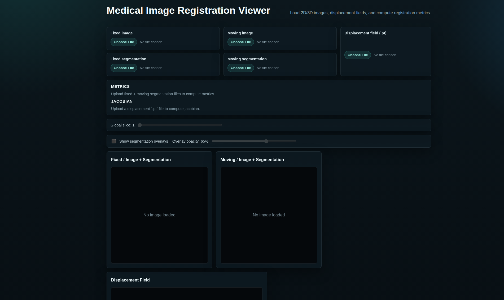

# Medical Image Registration Dashboard

A local desktop web app for visualizing 2D/3D medical images, displacement fields, and registration metrics.

## Features
- Load NIfTI images and raw PyTorch `.pt` displacement fields.
- Compute jacobian determinant and negative-jacobian fraction.
- Compute registration metrics: Dice, Dice95, Hausdorff, Hausdorff95.
- Minimal React + Vite frontend with viewer panels and metric display.

## Setup

### Backend

```bash
python3 -m venv .venv
source .venv/bin/activate
pip install -r backend/requirements.txt
```

### Frontend

```bash
cd frontend
npm install
```

## Run

Start the backend:

```bash
uvicorn backend.app.main:app --reload --port 8000
```

Start the frontend:

```bash
cd frontend
npm run dev
```

Open the local Vite URL shown in the browser.

## Test sample generation

The backend includes a sample generation utility at `backend/app/test_data.py`.

```bash
python -c "from backend.app import test_data; test_data.generate_and_save_samples()"
```

## Notes
- `.pt` displacement files are raw tensors saved by `torch.save()` with no metadata.
- Supported displacement tensor layouts include channel-first (`CxHxW`, `CxDxHxW`) or channel-last (`HxWxC`, `DxHxWxC`).
- The frontend currently sends upload requests to `http://localhost:8000`.
